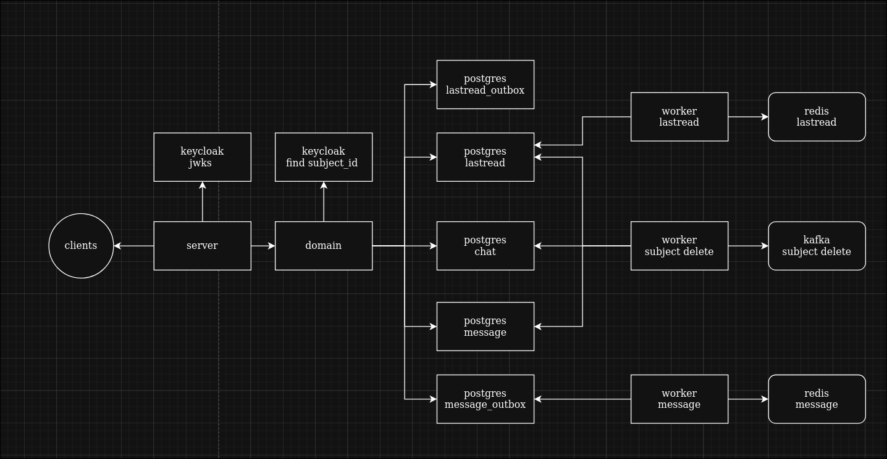

# Чаты

## Содержание:
- [Описание](#описание)
- [Реализация](#реализация)
- [Архитектура](#архитектура)
- [Структура директорий](#структура-директорий)

## Описание:
Этот сервис отвечает за CRUD операции с чатами и сообщениями, в том числе какое последнее прочитал пользователь. Он гарантирует одинаковое состояние диалогов для всех юзеров.

## Реализация:
- Это самый нагруженный сервис по объему данных и запросам, поэтому присутвуют индексы для сообщений и чатов.
- Введен счетчик сообщений для каждого чата, который увеличивается с транзакцией. Сделано для быстрого подсчета непрочитанных сообщений.
- Введена структура lastread которая говорит где пользователь остановился в чате, помогает быстро узнать положение в диалоге
- Работают фоновые воркеры для сообщений и состояний последних прочитанных сообщений пользователем,которые общаются с outbox таблицами и очередями сообщений. Запросы в outbox выполнены с помощью транзакций и skip locked, чтобы не мешать другим репликам. Так же все чтения и отправки данных сделаны батчами для уменьшения нагрузки на сеть.
- Холодное удаление для меньшей нагрузки на базу
- Пагинация на уровне запросов к базе данных для эффективного взаимодействия
- Обновления данных реализованы через версионирование
- Верификация через keycloak

## Архитектура:



## Структура директорий:
```text
.
├── cmd - запуск сервиса
├── config - конфиг
├── internal
│   ├── ctxkey - переменные контекста
│   ├── domain - бизнесс логика
│   ├── loglables - поля логирования
│   ├── model - доменные модели
│   ├── storage - взаимодействие с базой данных
│   ├── transport - сервер и хендлеры с middleware
│   └── wokers - фоновые воркеры
└── migrations - миграции базы данных
```