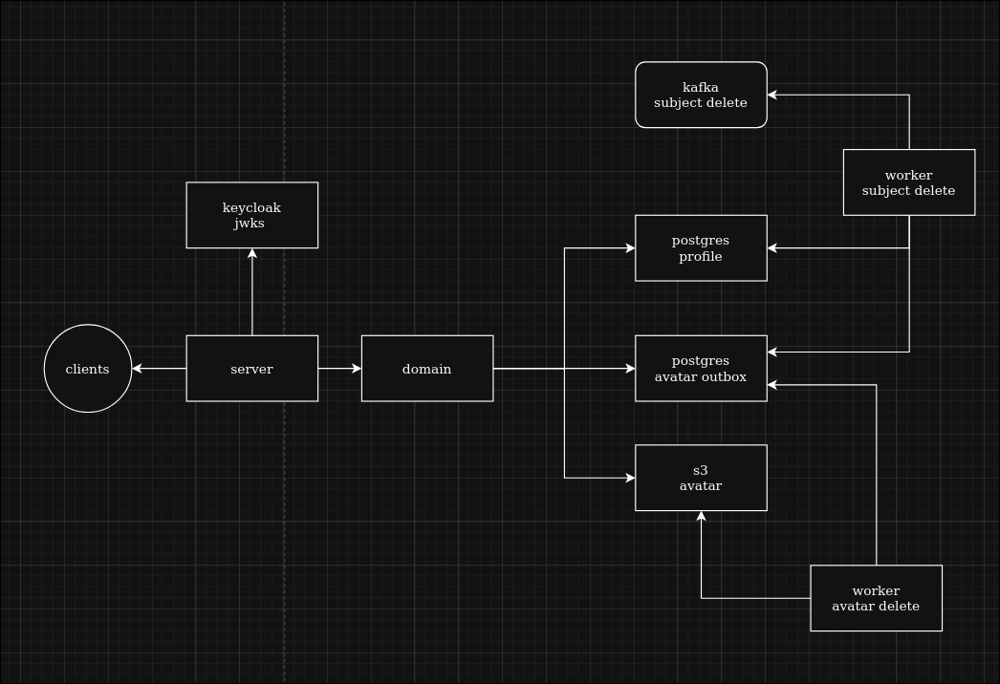
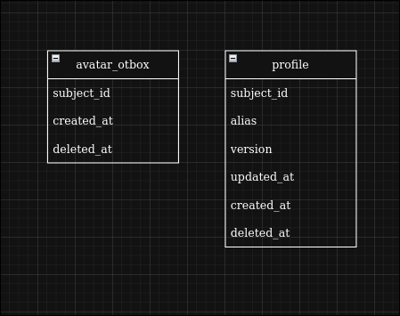

# Профили

## Содержание:
- [Описание](#описание)
- [Реализация](#реализация)
- [Архитектура](#архитектура)
- [Структура директорий](#структура-директорий)

## Описание:
Этот сервис реализовывает все CRUD операции с профилями

## Реализация:
- Сам по себе сервис должен выдерживать большое количество GET запросов. Поэтому была проведена работа с индексами для поиска по псевдониму и id. Реализовано холодное удаление, чтобы не нагружать сильно базу данных.
- Пагинация на уровне запросов к базе данных для эффективного взаимодействия
- Обновления данных реализованы через версионирование
- S3, используется presigned url, чтобы убрать лишнее взаимодействие с данными пользователя и скорости отправки данных. Удаление данных из S3 осуществляется батчами через outbox-паттерн, есть outbox таблица которую слушает воркер и удаляет данные, запросы из нее делаются через транзакцию и skip locked для работы нескольких сервисов одновременно.
- Kafka воркер который читает сообщение из keycloak об удалении юзера 
- Верификация через keycloak

## Архитектура:



## Структура директорий:
```text
.
├── cmd - запуск сервиса
├── config - конфиг
├── internal
│   ├── adapter - внешние сервисы
│   │   └── avatar - взаимодейсвие с s3 для хранение аватарок
│   ├── ctxkey - переменные контекста
│   ├── domain - бизнесс логика
│   ├── loglables - поля логирования
│   ├── model - доменные модели
│   ├── storage - взаимодействие с базой данных
│   ├── transport - сервер и хендлеры с middleware
│   └── wokers - фоновые воркеры
└── migrations - миграции базы данных